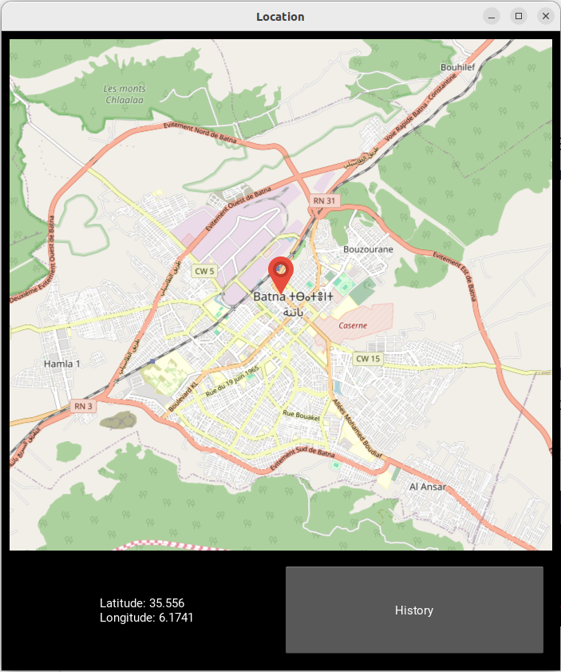

# GeoLocater
# Location Tracker App with Kivy

A simple Kivy application that tracks and displays the user's location using the `geocoder` library and Kivy's `MapView`. The app features a main screen with a live map view, real-time latitude and longitude display, and a history screen that logs location information.

## Features

- **Live Tracking:** Real-time tracking of the user's location on a map.
- **MapView:** Utilizes Kivy Garden's `MapView` for a user-friendly map display.
- **Location Details:** Displays real-time latitude and longitude information.
- **History Screen:** Logs location history with timestamps.
- **Data Storage:** Location data stored in XML format for easy retrieval.

## Getting Started

### Prerequisites

- Python 3.x
- Kivy and Kivy Garden: Install using `pip install kivy kivy_garden`
- geocoder: Install using `pip install geocoder`

### Running the App

1. Clone the repository: `git clone https://github.com/yourusername/location-tracker-kivy.git`
2. Navigate to the project directory: `cd location-tracker-kivy`
3. Run the app: `python LocationApp.py`

## Usage

- Launch the app to view the main screen with a live map and location details.
- Navigate to the history screen to view recorded location history.
- Data is stored in `location.xml`.

## Screenshots

## Contributing

Contributions are welcome! Please create a new branch for your changes and submit a pull request.

## License

This project is licensed under the [MIT License](LICENSE).

## Acknowledgments

- Special thanks to the Kivy and geocoder communities for their excellent libraries.

